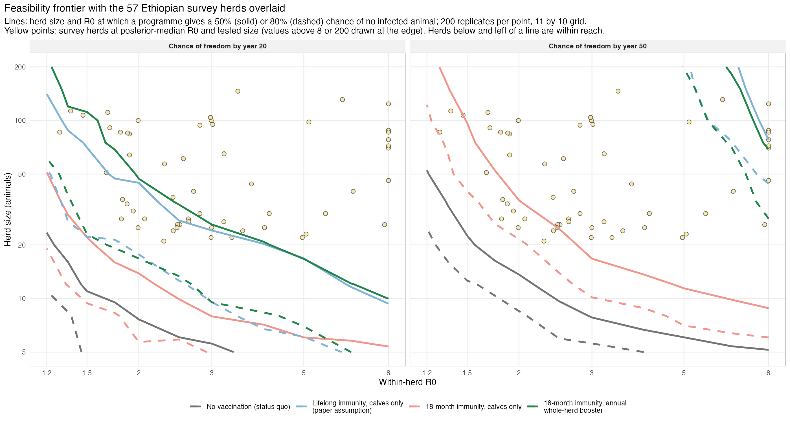
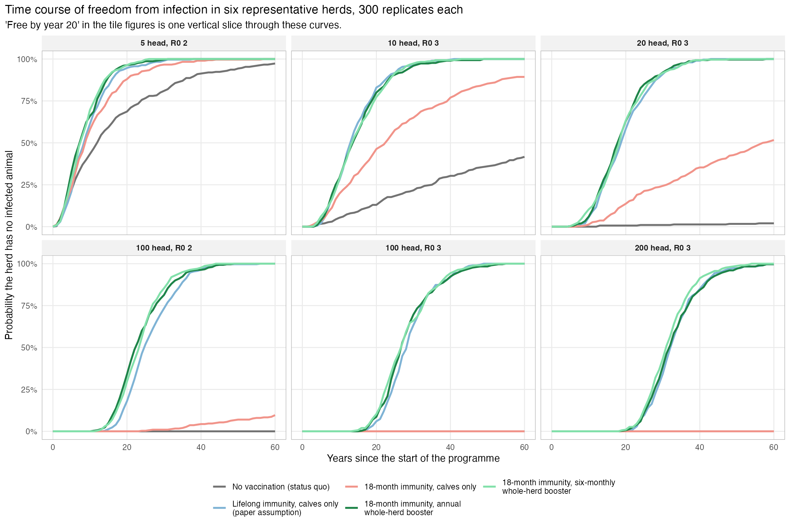
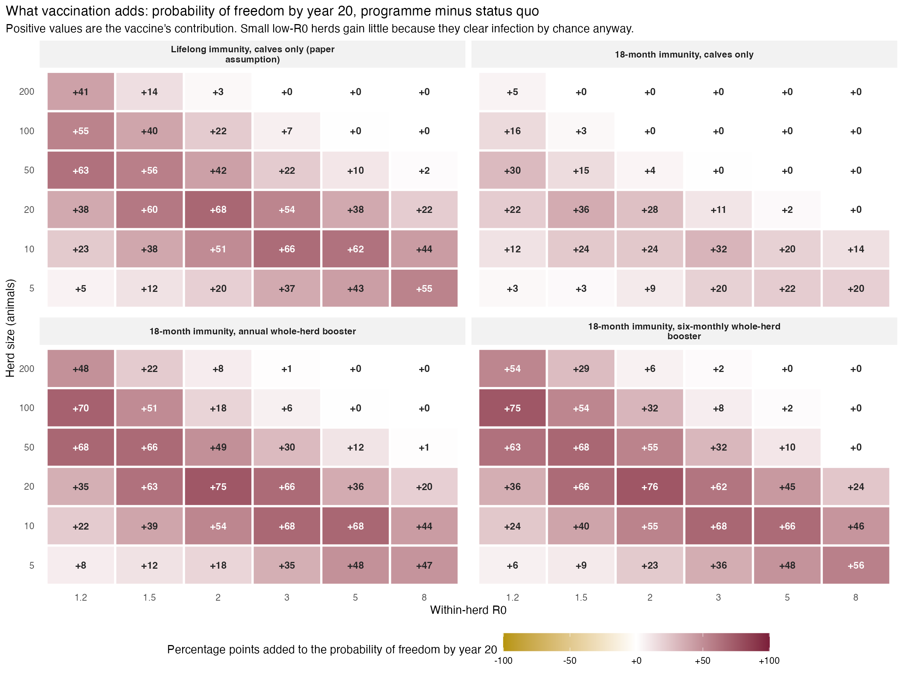
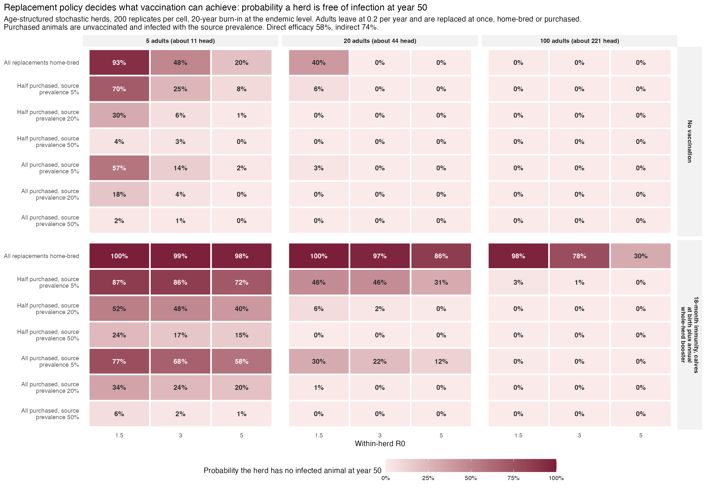
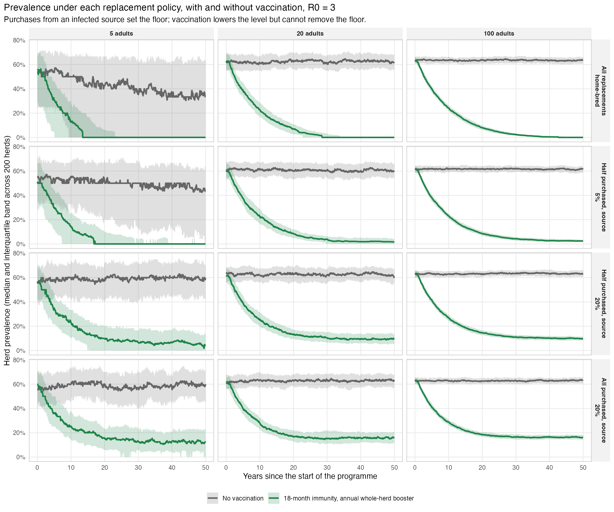

# Stochastic layer: figures and tables

Vivek Kapur, 9 September 2026. Everything here is reproducible from
github.com/kapurlab/bcg-elimination-sensitivity; scripts are named under
each figure and the tables are in the zip alongside this document.

All runs use the authors' S, I, V, IV transition list in SimInf with a
20-stage near-fixed protection chain, direct efficacy 58% and indirect 74%
(DST1 posterior medians), turnover 0.27 per year, and every calf dosed at
birth. Elimination is the first day a herd has no infected animal. Herds are
closed unless a replacement policy says otherwise.

## 1. Feasibility frontier with the survey herds

**Figure 1.** Herd size and within-herd R0 at which each programme gives a
50% (solid) or 80% (dashed) chance of a herd with no infected animal by year
20 (left) and by year 50 (right), from 200 replicate herds at each of 110
grid points (11 values of R0 from 1.2 to 8, 10 herd sizes from 5 to 200). Yellow points are the 57
ETHICOBOTS herds at their posterior-median R0 and tested herd size. Herds
below and left of a line are within reach of that programme. By year 20
almost every survey herd lies beyond every frontier; by year 50 the boosted
and lifelong programmes reach all but the herds with R0 above about 6 and
more than 50 head. The status quo line marks chance fade-out in small herds; the annual whole-herd booster
with 18-month immunity tracks the paper's lifelong assumption; calves-only
vaccination with 18-month immunity lies between. Script `R/run_frontier_fine.R`;
table `frontier_fine.csv`.

## 2. Time course of freedom in six representative herds

**Figure 2.** Probability that a herd has no infected animal, by year since
the programme started, for six herd-size and R0 combinations, 300
replicates each. "Free by year 20" in the tile figures is one vertical slice
through these curves. Curves separate at years 10 to 15 in large herds and
reach 100% by years 40 to 45 under any boosted programme; the 5-head herd
clears on its own. Script `R/run_alt_views.R`; table `survival_curves.csv`.

## 3. What vaccination adds over the status quo

**Figure 3.** Percentage points added by each programme to the probability
of freedom by year 20, relative to no vaccination, on the 6 by 6 grid of
R0 and herd size (200 replicates per cell). The underlying probabilities,
including the status quo panel, are in `stochastic_grid.csv` and figures
22 and 23 of the repository. Script `R/run_alt_views.R`.

## 4. Replacement policy in an age-structured herd

**Figure 4.** Probability a herd has no infected animal at year 50, in an
age-structured herd (calves, young stock, adults) with a fixed adult number
and adults leaving at 0.2 per year, each leaver replaced at once by a
home-bred heifer or by a purchase from a source population of the stated
prevalence. Purchased animals are unvaccinated. Rows are replacement
policies, columns R0, panels adult herd size and programme; 200 replicates,
20-year burn-in at the endemic level. Script `R/run_herd.R`; table
`herd_replacement.csv`.

**Figure 5.** Herd prevalence over time (median and interquartile band
across 200 herds) under four replacement policies at R0 3, with and without
vaccination. Purchases from an infected source set a floor that vaccination
lowers but cannot remove. Script `R/run_alt_views.R`; table
`replacement_trajectories.csv`.

## Tables in the zip

| File | Content |
| --- | --- |
| `stochastic_grid.csv` | 6 by 6 grid, five programmes: probability free by years 10, 20, 50, 100; median time; R_v |
| `frontier_fine.csv` | 11 by 10 grid, four programmes: probability free by years 20 and 50 |
| `survival_curves.csv` | yearly probability free, six herds, five programmes |
| `herd_replacement.csv` | replacement policy by adult herd size and R0: probability free and prevalence at years 20 and 50, median time, herd size |
| `replacement_trajectories.csv` | yearly prevalence quantiles and probability free, replacement policies at R0 3 |
| `archetypes.csv` | herd archetypes for Ethiopia and India, with the fields still to be filled |
| `cost_parameters_template.csv` | generic parameter table for the economic layer, values blank |

## Two things I would value your view on

1. The herd model defines R0 for an adult infection lasting one adult
   residence (1 over the culling rate) and applies it across age classes
   with frequency-dependent mixing. Is that the right anchor, or should
   R0 be defined on the whole-herd turnover as in the survey estimates?
2. Purchases replace a fixed share of leavers from a source of fixed
   prevalence. The next step toward your network is to draw the source
   prevalence from a distribution across herds and let it change as the
   programme runs. Is a two-pool version (vaccinated herds trade with
   vaccinated herds) worth building before a network?
